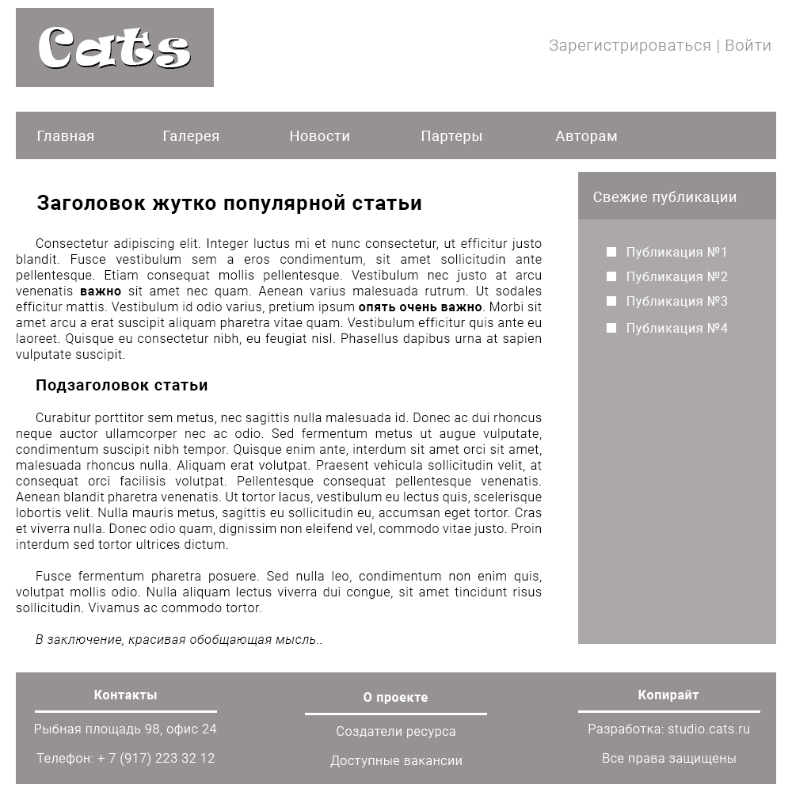
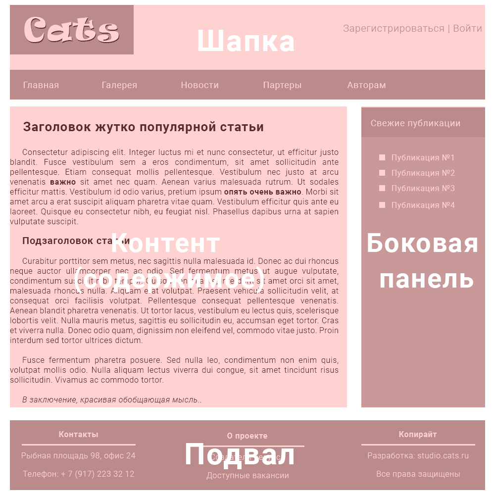

## Глава 3. Структура веб-сайта

Начиная с первой главы мы много говорили о тексте. О его структуре и семантике. Несмотря на то, что HTML был задуман, как способ обмена научной и технической документацией, этой сферой его применение не ограничивается.

Уже достаточно давно язык гипертекстовой разметки используется в качестве фундамента любого веб-сайта. Он позволяет описать сложную структуру веб-страницы, разбив её на относительно простые компоненты.

Большинство сайтов в интернете, до тех пор пока мы не говорим об онлайн игре или нестандартном веб-проекте, имеют в своей основе схожие части.

### Компоненты веб-сайта

Давайте взглянем на типичную веб-страницу.

Хотя страница и выглядит, как "Привет!" из 2007, она все же хорошо подходит, чтобы разобраться в базовой структуре сайта.

Думаю Вам не составит труда, определить общие компоненты, которые часто встречаются на разных сайтах.

Список компонентов со страницы Cats.ru выглядит следующим образом:
1. _Шапка сайта_
2. _Панель навигации_
3. _Боковая панель_
4. _Основной контент_
5. _Подвал_

Теперь наша задача разобраться в возможном HTML представлении данных компонентов. Пойдем по порядку.

### Шапка сайта

### Навигация

### Боковая панель

### Подвал

### Контент
