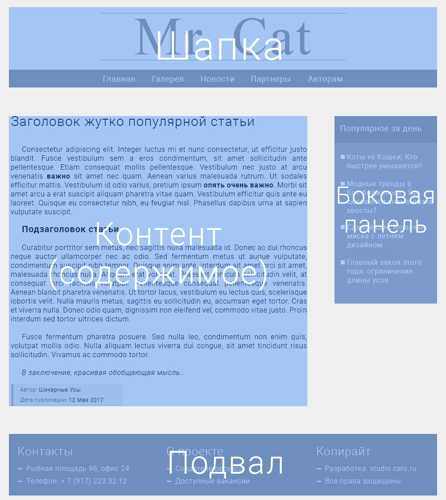

## Глава 3. Структура веб-сайта

Начиная с первой главы мы много говорили о тексте. О его структуре и семантике.

Несмотря на то, что HTML был задуман, как способ обмена научной и технической документацией, этой сферой его применение не ограничивается.

Уже достаточно давно язык гипертекстовой разметки используется в качестве фундамента любого веб-сайта. Он позволяет описать сложную структуру веб-страницы, разбив её на относительно простые компоненты.

Большинство сайтов в интернете, до тех пор пока мы не говорим об онлайн игре или нестандартном веб-проекте, имеют в своей основе схожие части.


### Компоненты веб-сайта

Давайте взглянем на типичную веб-страницу.


Хотя страница и выглядит, как "Привет!" из 2007, она все же хорошо подходит, чтобы разобраться в базовой структуре сайта.

Думаю Вам не составит труда, определить общие компоненты, которые часто встречаются на разных сайтах.



Список компонентов со страницы Cats выглядит следующим образом:
1. Шапка сайта
2. Панель навигации
3. Боковая панель
4. Основной контент
5. Подвал

Теперь наша задача разобраться, как представить данные компоненты, используя HTML-код.


### Шапка сайта


__Шапка сайта__ (eng. _Header_) - расположенный в верхней части страницы компонент, который содержит общие сведения о сайте (например логотип и девиз), которые не изменяются от страницы к странице.

В шапке могут находиться и некоторые универсальные элементы, которые должные быть доступны на всём сайте. Хорошим примером будет блок навигации и поле поиска.

В HTML5 для разметки шапки используется элемент `header`.

```html
<header>
  
  <a href="/sing-up/">Зарегистрироваться</a>
  <a href="/log-in/">Войти</a>
</header>
```

Возможно, Вы заметили, что в примере Cats шапка содержала еще и навигационную панель, однако я вынес её данной секции. На то есть причины. Но давайте по порядку.


### Навигация по сайту

Для того, чтобы пользователь мог свободно переходить между разделами и веб-страницами, разработчики добавляют навигационную панель.

__Навигационная панель__ (eng. _Navigation bar_) - важный компонент сайта, часто представленный списком ссылок или группой кнопок, который позволяет ориентироваться в структуре веб-ресурса.

В большинстве случаев, навигационная панель, как и шапка, на всех страницах одинаковая. Это хорошая практика, так как изменение навигации может привести к недопонимаю (или даже раздражению) со стороны пользователя.

Навигационная панель легко добавляется при помощи элемента `nav`, в котором достаточно перечислить ссылки на основные разделы сайта.

```html
<nav>
  <a href="/home/">Главная</a>
  <a href="/gallery/">Галерея</a>
  <a href="/news/">Новости</a>
  <a href="/partners/">Партнеры</a>
  <a href="/for-authors/">Авторам</a>
</nav>
```

Теперь два небольших, но важных замечания касательно `nav`.

Во-первых, этот элемент может быть размещен как внутри `header`, так и вне этого элемента. Многие разработчики размещают навигационную панель внутри шапки, так оба этих элемента остаются постоянным на всём сайте.

Во-вторых, в `nav` должна содержаться только основная навигация, вроде навигации по сайту или __содержание контента__ (eng. _Table of content_). Однако это не значит, что на странице всегда должен быть только один элемента `nav`.


### Боковая панель

### Подвал

### Контент
