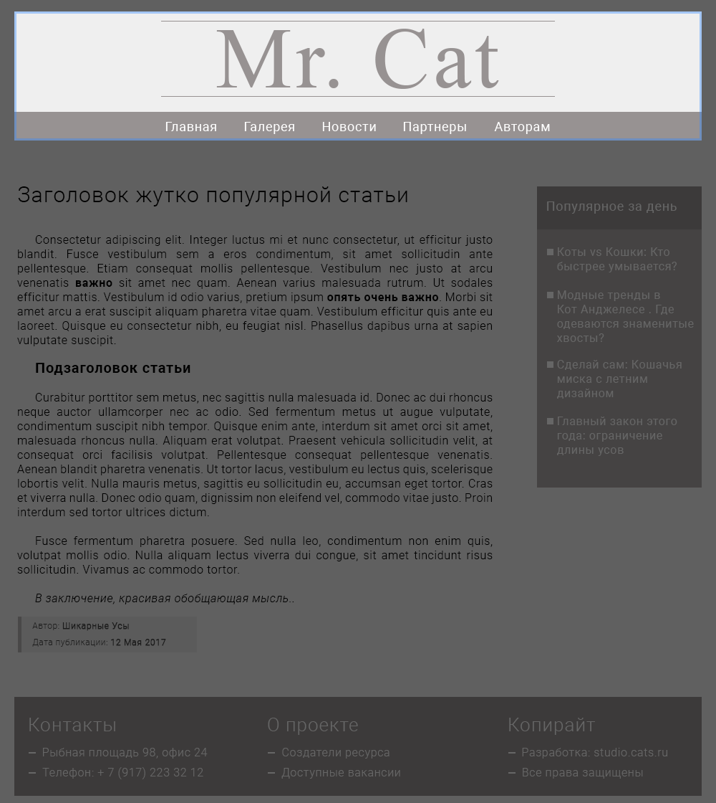
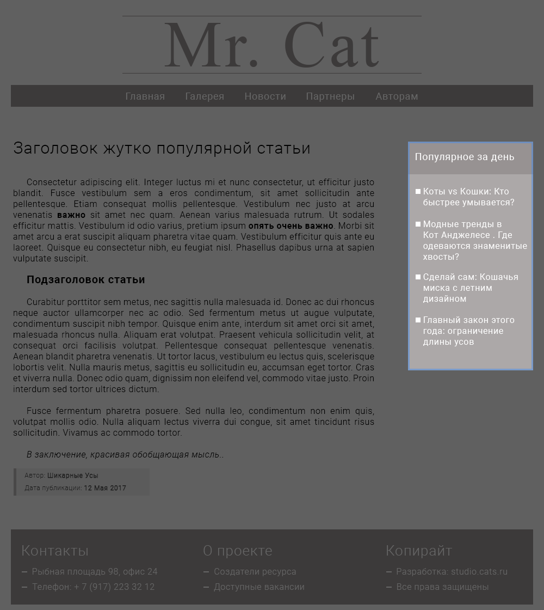
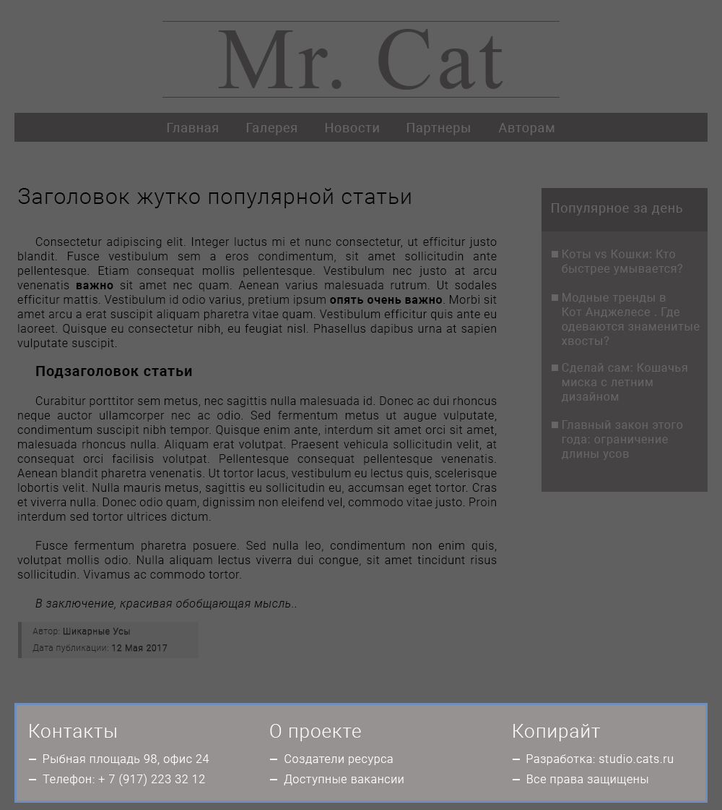

## Глава 3. Структура веб-сайта

Начиная с первой главы мы много говорили о тексте. О его структуре и семантике.

Мы уделили много внимания тексту, так как именно текст является краеугольным камнем HTML. Действительно, с самого начала этот язык задумывался как простой способ семантического описания научной и технической документации.

Современный язык разметки расширил понятия семантики и структуры на _очень большие текстовые блоки_ - веб-сайты.

Не секрет, что HTML достаточно давно используется в качестве фундамента веб-сайтов, приложений и сервисов в интернете.

Развиваясь и эволюционируя, HTML оказался на сцене, как богатый набор примитивных элементов, которые благодаря декомпозиции и сочетанию позволяют описывать совсем не тривиальные структуры.

Декомпозиция и сочетание - понятия, которые любой фронтенд-разработчик ежедневно применяет в работе.

Наша задача, как начинающих фронтенд-разработчиков - понять принцип декомпозиции, изучив компоненты, присутствующие на многих веб-сайтах, а также их HTML представлением. Как говорил Шерлок в одноименном сериале, The game is on!

<!--
Обращали ли Вы ранее внимание, что многие веб-сайты имеют схожую структуру. На многих ресурсах не сложно выделить общие части, которые встречаются повсеместно. Именно в этом и заключается наша задача - определить основные компоненты веб-сайта.
-->

### Компоненты веб-сайта


Может главная страница этого сайта и выглядит, как "Hello, World!" от молодого одаренного веб-дизайнера, которого не все поймут, она все же хорошо подходит, чтобы разобраться в базовой структуре сайта.

Я думаю, Вам не составит труда выделить компоненты, часто встречающиеся на разных сайтах.


На практике такая задача - определение составляющих будущего сайта или веб-приложения по макету - встречается очень часто.

И кстати, расположение визуальных компонентов на странице называется __лейаут__ (eng. _Layout_). Есть и русский термин - __раскладка__ страницы, но его используют редко, обычно пользуясь транслитерацией с английского.

На приведённом выше примере лейаут содержит следующие компоненты:
1. Шапка сайта
2. Панель навигации
3. Боковая панель
4. Основной контент
5. Подвал

Теперь наша задача разобраться, как представить данные компоненты, используя HTML-код.


### Шапка сайта



__Шапка сайта__ (eng. _Header_) - расположенный в верхней части страницы компонент, который содержит общие сведения о сайте (например логотип, слоган или девиз), которые, как правило, почти не изменяются на всех страницах сайта.

В этом компоненте могут находиться и некоторые универсальные элементы, которые должные быть доступны на всём сайте. Хороший примером - блок навигации, поле поиска или панель авторизации.

HTML5 для разметки шапки предоставляет элемент `header`.

```html
<header>
  
</header>
```

В нашем примере шапка содержит еще и ссылки на основные страницы сайта. Перейдем к ним.

### Навигационная панель

__Навигационная панель__ (eng. _Navigation bar_) - важный компонент сайта, часто представленный списком ссылок или группой кнопок, который позволяет ориентироваться в структуре веб-ресурса.

Своеобразный гид по местным просторам.

В большинстве случаев навигационная панель, как и шапка, одинаковая на всех страницах. Считайте это хорошей практикой, так как неоправданное изменение навигации может привести к недопонимаю (или даже раздражению) со стороны пользователя.

Навигационная панель легко добавляется при помощи элемента `nav`, в котором достаточно перечислить ссылки на основные разделы сайта.

```html
<nav>
  <a href="/home/">Главная</a>
  <a href="/gallery/">Галерея</a>
  <a href="/news/">Новости</a>
  <a href="/partners/">Партнеры</a>
  <a href="/for-authors/">Авторам</a>
</nav>
```

Элемент `nav` должен содержать только основную навигацию, вроде ссылок на главные разделы сайта или __оглавление содержимого__ (eng. _Table of content_) с данной страницы. Проще говоря, не все группы нужно помещать в данный тег. Однако это не значит, что элемент на странице всегда присутствует лишь в единственном экземпляре - навигация вполне может быть продублирована.

Например, можно добавить один `nav` с ссылками на главные разделы веб-сайта, а другой с навигацией по контенту данной страницы.

На сайте Mr. Cat навигация размещена внутри `header`.

```html
<header>
  
  <nav>
    <a href="/home/">Главная</a>
    <a href="/gallery/">Галерея</a>
    <a href="/news/">Новости</a>
    <a href="/partners/">Партнеры</a>
    <a href="/for-authors/">Авторам</a>
  </nav>
</header>
```

Но Вы вполне можете использовать эти элементы отдельно.

```html
<header>
  
</header>
<nav>
  <a href="/home/">Главная</a>
  <a href="/gallery/">Галерея</a>
  <a href="/news/">Новости</a>
  <a href="/partners/">Партнеры</a>
  <a href="/for-authors/">Авторам</a>
</nav>
```

Многие разработчики размещают навигационную панель внутри шапки, так эти элементы часто логически связаны и они в большинстве остаются неизменными на всех страницах.


### Боковая панель



__Боковая панель__ (eng. _Sidebar_) - компонент, часто содержащий дополнительную (второстепенную) информацию, косвенно связанную с основным содержимым. Сюда удобно помещать ссылки на статьи по данной тематике, сноски или рекламные объявления.

Боковую панель легко добавить при помощи элемента `aside`.

```html
<aside>
  <ul>
    <li><a href="#">Коты vs Кошки: Кто быстрее умывается?</a></li>
    <li><a href="#">Модные тренды в Кот Анджелесе. Где одеваются знаменитые Мягкие Лапки?</a></li>
    <li><a href="#">Сделай сам: Кошачья миска с летним дизайном</a></li>
    <li><a href="#">Главный закон этого года: ограничение длины усов</a></li>
  </ul>
</aside>
```

Элемент `aside` может представлять не только боковую панель, которая находится обычно слева или справа от основного контента, но и прочее, неглавное содержимое, как комментарии по тексту, врезки и так далее.

К остальному можно добавить, что в `aside` часто находятся виджеты на разные социальные сети, вроде Twitter или VK.


### Подвал

__Подвал__ (eng. footer - нижний колонтитул, у ног) - самая нижняя часть сайта, куда помещают __копирайт__ (eng. copyright), краткую информацию о разработчике, ссылки на медиа.



Сюда вполне можно добавить альтернативную навигацию или ссылки на не очень важную, но все еще интересную информацию.

Создать подвал на сайте легко при помощи элемента `footer`.

```html
<footer>
  <h2>Контакты</h2>
  <ul>
    <li>Рыбная площадь 98, офис 24</li>
    <li>Телефон: + 7 (917) 223 32 12</li>
  </ul>
  <h2>О проекте</h2>
  <ul>
    <li>Создатели ресурса</li>
    <li>Доступные вакансии</li>
  </ul>
  <h2>Копирайт</h2>
  <ul>
    <li>Разработка: studio.cats.ru</li>
    <li>Все права защищены.</li>
  </ul>
</footer>
```

Любопытно, что согласно стандарту, данный элемент обязательно располагать в нижней части сайта. Например, можно использовать `footer` дважды, один в начале контента, а другой в конце.

```html
<footer><a href="../">Вернуться к оглавлению</a></footer>
<h2>3.1 Анатомия кошек</h2>
<p>...</p>
<p>...</p>
<p>...</p>
<footer><a href="../">Вернуться к оглавлению</a></footer>
```

### Контент
