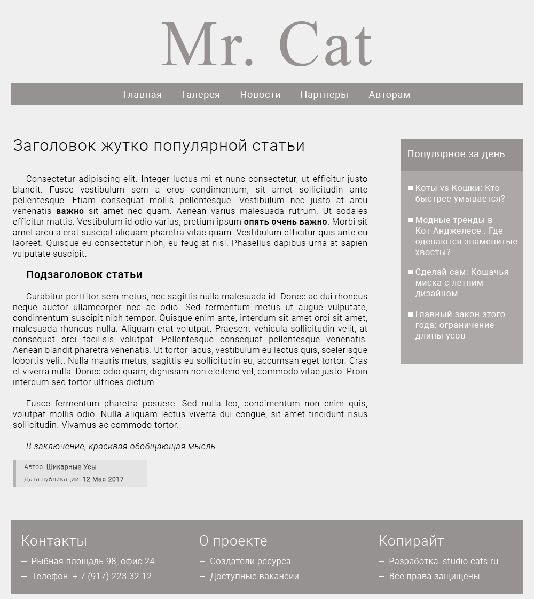

## Глава 3. Структура веб-сайта

Начиная с первой главы мы много говорили о тексте. О его структуре и семантике.

Несмотря на то, что HTML был задуман, как способ обмена научной и технической документацией, этой сферой его применение не ограничивается.

Уже достаточно давно язык гипертекстовой разметки используется в качестве фундамента любого веб-сайта. Он позволяет описать сложную структуру веб-страницы, разбив её на относительно простые компоненты.

Большинство сайтов в интернете, до тех пор пока мы не говорим об онлайн игре или нестандартном веб-проекте, имеют в своей основе схожие части.


### Компоненты веб-сайта

Давайте взглянем на типичную веб-страницу.



Хотя страница и выглядит, как "Привет!" из 2007, она все же хорошо подходит, чтобы разобраться в базовой структуре сайта.

Думаю Вам не составит труда, определить общие компоненты, которые часто встречаются на разных сайтах.


Список компонентов со страницы Cats выглядит следующим образом:
1. Шапка сайта
2. Панель навигации
3. Боковая панель
4. Основной контент
5. Подвал

Теперь наша задача разобраться как представить данные компоненты, используя HTML-код.


### Шапка сайта


__Шапка сайта__ (eng. _Header_) - расположенный в верхней части страницы компонент, который содержит общие сведения о сайте (например логотип и девиз), которые не изменяются от страницы к странице.

В шапке могут находиться и некоторые универсальные элементы, которые должные быть доступны на всём сайте. Хорошим примером будет блок навигации и поле поиска.

В HTML5 для разметки шапки используется элемент `header`.

```html
<header>
  
  <a href="/sing-up/">Зарегистрироваться</a>
  <a href="/log-in/">Войти</a>
</header>
```


### Навигация

### Боковая панель

### Подвал

### Контент
